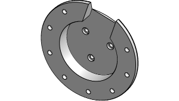
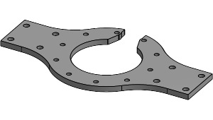

[pointers to item links below]: #

[RMD-x8]: https://uk.robotshop.com/products/my-actuator-rmd-x8-pro-v2-can-bus-bldc-actuator-w-19-reduction-mc-x-300-o-driver
[PI]: https://thepihut.com/products/raspberry-pi-5?variant=42531604955331
[SD]: https://uk.rs-online.com/web/p/sd-cards/2836581
[CAN-HAT]: https://www.waveshare.com/2-ch-can-fd-hat.htm

[M4I]: https://ebay.us/m/BUPcYn
[M4x30C]: https://ebay.us/m/XLIqXn
[M4x20C]: https://ebay.us/m/y3svrC
[M4x16C]: https://ebay.us/m/ICN1YX
[M4x8C]: https://ebay.us/m/ASdklv
[M4x10CS]: https://ebay.us/m/useJ9E
[M5x35BH]: https://ebay.us/m/N0DYHb
[M5N]: https://ebay.us/m/qY9aDb
[M4N]: https://ebay.us/m/3rJfDg
[TP26]: https://www.bearingboys.co.uk/5M-Section-Timing-Pulley-5mm/265M15-Metric-Pilot-Bore-Timing-Pulley-21236-p
[TB635]: https://www.bearingboys.co.uk/5M-Section-5mm-Pitch/6355M15-Timing-Belt-6109-p
[B22]: https://www.bearingboys.co.uk/Miniature-Bearings/6082RS-Dunlop-Sealed-Miniature-Steel-Ball-Bearing-8mm-x-22mm-x-7mm-7728-p
[B12]: https://www.bearingboys.co.uk/Miniature-Bearings/MR128ZZ-Budget-Shielded-Miniature-Ball-Bearing-8mm-x-12mm-x-35mm--140413-p

[EX2020]: https://ooznest.co.uk/product/20x20mm-t-v-slot-aluminium-extrusion-profile-silver-cut-to-size/
[SBR12]: https://ebay.us/m/hoO5Eb

# Parts list
This document shows everything needed to build the leg, for the assembly please read the [Assembly Guide](https://github.com/Faizanfaiz/UWE-Mechatronics/tree/main/Assembly#assembly). 

## 3D prints
>[!NOTE]
>All parts can fit on a minimum printer bed size of 256x256mm.  
>Everything was printed on the Bambu Lab A1 and X1 Carbon in PolyTerra PLA Fossil Grey.

### Print settings
- 35% infill
- Triangular infill
- Supports enabled
- 2 or 3 layer thick walls
- Bottom Z distance = 0.08mm
- Outer and inner brim 5mm

### 
| Thumbnail                                               | Name               | Quantity |
|:-------------------------------------------------------:|:------------------:|:--------:|
|    | upper leg back     | 1        |
|   | upper leg front    | 1        |
|    | lower leg back     | 1        |
|   | lower leg front    | 1        |
|         | tension pin        | 4        |
|          | pulley pin         | 1        |
|      | pulley adapter     | 1        |
|               | coupler            | 1        |
|           | motor plate        | 1        |

### Depreciated
| Thumbnail   | Name   | Reason     |
|:-----------:|:------:|:----------:|
|             |        |            |

## Hardware
### Electronics needed
>[!NOTE]
>The motor can be swapped for similar motors with same diameter and bolting layout.

| Item + Link                         | Short description                           | Quantity | Cost per item |
|-------------------------------------|---------------------------------------------|:--------:|:--------------|
| [RMD-X8 motor][RMD-x8]              | drive the upper and lower leg               |    2     |    ~£400      |
| [Raspberry pi 5 8GB][PI]            | main board for executing code               |    1     |    £76.80     |
| [waveshare 2CH CAN FD HAT][CAN-HAT] | SPI to CAN conversion                       |    1     |    £35.75     |
| [SD card 32GB][SD]                  | raspeberry pi os 64x installed              |    1     |    £9.98      |
| **Total**                           |                                             |          | **£1,322.53** |

### Hardware for the leg
| Item + Link                         | Short description                         | Quantity | Cost per item/pack |
|:------------------------------------|:------------------------------------------|:--------:|:-------------------|
| [M4 inserts][M4I]                   | one side of both upper and lower leg      |    14    | £6.49 / 50 pack    |
| [M4x30 cap][M4x30C]                 | pulley pin                                |     1    | £3.42 / 5 pack     |
| [M4x20 cap][M4x20C]                 | upper leg enclosure                       |     8    | £3.84 / 10 pack    |
| [M4x16 cap][M4x16C]                 | lower leg enclosure                       |     6    | £3.54 / 10 pack    |
| [M4x8 cap][M4x8C]                   | coupler between both motors and the leg   |    11    | £4.00 / 20 pack    |
| [M4x10 countersunk][M4x10CS]        | attaching driven pulley to lower leg      |     8    | £3.03 / 10 pack    |
| [M5x35 button head][M5x35BH]        | pulley tensioner                          |     2    | £3.54 / 5 pack     |
| [M5 nut][M5N]                       | pulley tensioner                          |     2    | £2.64 / 5 pack     |
| [M4 nut][M4N]                       | pulley pin                                |     1    | £2.64 / 5 pack     |
| [26-5M-15 Timing Pulley][TP26]      | moving the lower leg                      |     2    | £8.20              |
| [635-5M-15 Timing Belt][TB635]      | moving the lower leg                      |     1    | £7.37              |
| [22x8x7mm bearing][B22]             | for the pulleys                           |     3    | £2.04              |
| [12x8x3.5mm bearing][B12]           | for the belt tensioner                    |     4    | £2.61              |
| **Total**                           |                                           |          | **£67.76**         |

### Hardware for the frame
| Item + Link                                   | notes                  | Quantity | cost per item  |
|:----------------------------------------------|:-----------------------|:--------:|:---------------|
| [2020 extrusion 1.2m][EX2020]                 | cut/ordered to length  | 3        | £9.22          |
| [SBR12 linear guide rail 500mm 2pcs][SBR12]   |                        | 2        | £26.59         |
| **Total**                                     |                        |          | **£80.84**     |

### Total cost: ~£1,471.13 (Subject to change)

